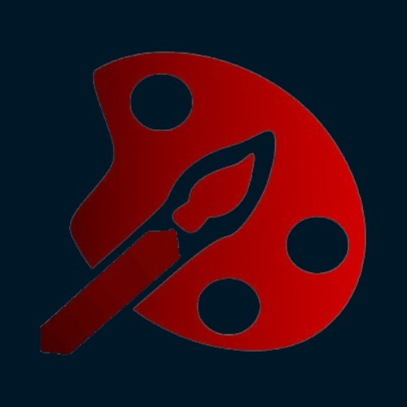
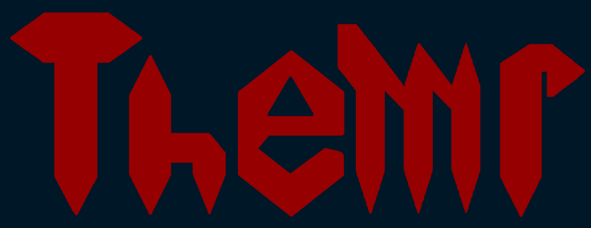

<p align="center">
  
</p>
<h1 align="center">Themr</h1>
<h3 align="center">The most powerful web extension made for customizing your web pages with style.</h3>
<hr>

<div align="center">
  <p>
    
  </p>
  <hr>
  This project has been redesigned by SunFlare Network for Chromium and Gecko web engines.<br>
  Support for Solarium coming soon.
</div>
<hr>
<div align="center">

## 📑 Table of Contents
- [Features](#features)
- [Installation](#installation)
- [Setup](#setup)
- [Links](#links)
- [Contributions](#contributions)


## 🚀 Features <a name="features"></a>
- Customize your web pages with style  
- Create and publish your own themes  
- Access a full theme store directly from the extension  
- Clean and simple UI  


<hr>

## 💾 Installation <a name="installation"></a>

To install Themr officially, visit the [Themr Website](https://themr.hdevelopment.tk/) and choose your browser engine.  
If the download buttons aren't working or you want a preview / beta / canary / snapshot version, follow the steps below:


**1. Go to Releases**  
Click the *Releases* tab on the right panel of the repository and download the latest stable version.  
Alternatively, click **Code > Download ZIP** to get the preview build.


**2. Unzip the Downloaded File**  
Extract the contents of the ZIP file.


**3. Enable Developer Mode**  
Go to your browser's **Extensions** page and enable **Developer Mode** (usually via the settings or extensions icon).


**4. Load the Extension**  
Click **"Load Unpacked"**, then navigate to the unzipped folder.  
Load the `Themr_main_assets` folder under the `Solarium_engine` directory.


**✅ Done!**  
Themr is now installed. If you face any issues, retry the steps or contact support on [Discord](https://discord.gg/GZQrhyjfXe).

<hr>

## 🛠️ Setup <a name="setup"></a>

### Development Setup

To start developing, first install the [Dependencies](#dependencies),  
then clone the repository, pasting 

```bash
gh repo clone HunterTheD3V/Themr
```

### 📦 Dependencies <a name="dependencies"></a>

**Frameworks required by Themr:**
- Node.js v23.x *(legacy support: v19.8.1)*
- NPM v10.9.x *(legacy support: v7.43.x)*
- JsDelivr CDN
- Axios v1.9.0

**NPM packages used:**
- express
- socket.io

**Languages used:**
- JavaScript
- HTML5
- CSS
- PHP

<hr>

## 🔗 Links <a name="links"></a>
- 🌐 [Website](https://themr.hdevelopment.tk/index.html)
- 💻 [GitHub](https://github.com/NickHunterD3V/HytesCord-Themr)
- 🎮 [Discord Server](https://discord.gg/GZQrhyjfXe)

<hr>

## 🤝 Contributions <a name="contributions"></a>

Project by [HunterCr4ft](https://github.com/HunterTheD3V) from **SunFlare Technologies**  
Originally developed by **HyTera Development**, now maintained by **SunFlare DV**, a subsidiary of **SunFlare Network**

**Wanna contribute?** Open a Pull Request!  
⚠️ To contribute, you must be an active verified member of our [Community Discord Server](https://discord.gg/GZQrhyjfXe).

<hr>

### 🧠 Made by SunFlare Technologies ©

Open-source project maintained by **SunFlare DV** & **SunFlare Network**.  
Originally started by **HyTera Development** (now SunFlare DV).  

All branding and image rights reserved.  
For licensing info, check the `LICENSE` file.
